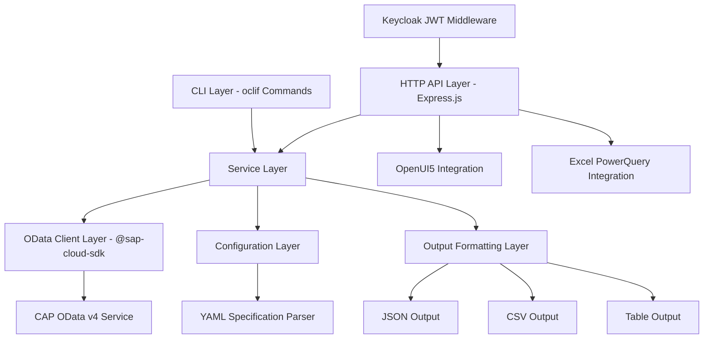

# Design Document: Financial Reports CLI

## Overview

The Financial Reports CLI is a TypeScript-based dual-mode application built with oclif that provides a typed wrapper around @sap-cloud-sdk for querying OData v4 datasources (CAP services) to retrieve financial reports. The tool operates in two modes:

1. **CLI Mode**: Traditional command-line interface accepting YAML report specification files
2. **HTTP API Mode**: RESTful API server for integration with OpenUI5 applications and Excel PowerQuery

The application supports multi-client integration through Keycloak JWT authentication and runs in Docker containers for scalable deployment.

## Architecture

The application follows a layered architecture with clear separation of concerns, supporting both CLI and HTTP API modes:



### Key Architectural Principles

1. **Dual-Mode Operation**: Support both CLI and HTTP API interfaces with shared business logic
2. **Separation of Concerns**: CLI/HTTP layers handle user interaction, services handle business logic, clients handle data access
3. **Type Safety**: Leverage TypeScript and @sap-cloud-sdk's typed OData clients throughout
4. **Configuration-Driven**: YAML report specifications drive query generation and execution
5. **Extensible Output**: Support multiple output formats through a pluggable formatting system
6. **Secure Multi-Client**: JWT-based authentication for API access from multiple client types
7. **Container-Ready**: Designed for Docker deployment with environment-based configuration

## Components and Interfaces

### CLI Command Layer

**ReportCommand** (oclif Command)

- Handles command-line argument parsing and validation
- Orchestrates the report generation workflow
- Manages error handling and user feedback

```typescript
interface ReportCommandArgs {
  specFile: string;
}

interface ReportCommandFlags {
  output?: 'json' | 'csv' | 'table';
  verbose?: boolean;
  destination?: string;
}
```

### HTTP API Layer

**ApiServer** (Express.js Application)

- Provides RESTful endpoints for report generation
- Handles JWT authentication middleware
- Supports both synchronous and asynchronous report generation

```typescript
interface ApiServer {
  start(port: number): Promise<void>;
  stop(): Promise<void>;
}

interface ApiEndpoints {
  'POST /api/reports': (spec: ReportSpecification) => Promise<ReportResult>;
  'GET /api/reports/:id': (id: string) => Promise<ReportResult>;
  'GET /api/health': () => Promise<HealthStatus>;
}

interface AuthenticatedRequest extends Request {
  user: {
    sub: string;
    email: string;
    roles: string[];
  };
}
```

**KeycloakAuthMiddleware**

- Validates JWT tokens from Keycloak
- Extracts user information for authorization
- Handles token refresh and validation

```typescript
interface KeycloakAuthMiddleware {
  validateToken(token: string): Promise<TokenValidationResult>;
  extractUserInfo(token: string): Promise<UserInfo>;
}

interface TokenValidationResult {
  valid: boolean;
  user?: UserInfo;
  error?: string;
}

interface UserInfo {
  sub: string;
  email: string;
  roles: string[];
  exp: number;
}
```

### Service Layer

**ReportService**

- Core business logic for report generation
- Coordinates between configuration parsing, OData querying, and output formatting
- Supports both synchronous and asynchronous execution modes

```typescript
interface ReportService {
  generateReport(
    specFile: string,
    options: ReportOptions
  ): Promise<ReportResult>;
  generateReportFromSpec(
    spec: ReportSpecification,
    options: ReportOptions
  ): Promise<ReportResult>;
  generateReportAsync(
    spec: ReportSpecification,
    options: ReportOptions
  ): Promise<AsyncReportResult>;
  getAsyncReportStatus(reportId: string): Promise<AsyncReportStatus>;
}

interface ReportOptions {
  outputFormat: OutputFormat;
  verbose: boolean;
  destination?: string;
  userId?: string;
  requestId?: string;
}

interface ReportResult {
  data: FinancialData[];
  metadata: ReportMetadata;
}

interface AsyncReportResult {
  reportId: string;
  status: 'pending' | 'processing' | 'completed' | 'failed';
  estimatedCompletion?: Date;
}

interface AsyncReportStatus {
  reportId: string;
  status: 'pending' | 'processing' | 'completed' | 'failed';
  progress?: number;
  result?: ReportResult;
  error?: string;
  createdAt: Date;
  completedAt?: Date;
}
```

**ConfigurationService**

- Parses and validates YAML report specification files
- Provides typed configuration objects
- Supports environment-based configuration for Docker deployment

```typescript
interface ConfigurationService {
  parseYamlSpecification(filePath: string): Promise<ReportSpecification>;
  parseYamlContent(yamlContent: string): Promise<ReportSpecification>;
  validateSpecification(spec: ReportSpecification): ValidationResult;
  loadEnvironmentConfig(): Promise<EnvironmentConfig>;
}

interface EnvironmentConfig {
  keycloak: KeycloakConfig;
  odata: ODataConfig;
  server: ServerConfig;
}

interface KeycloakConfig {
  realm: string;
  authServerUrl: string;
  clientId: string;
  clientSecret?: string;
}

interface ServerConfig {
  port: number;
  host: string;
  corsOrigins: string[];
}
```

### OData Client Layer

**FinancialDataClient**

- Wraps @sap-cloud-sdk OData v4 client functionality
- Provides typed methods for querying financial entities
- Handles authentication and connection management

```typescript
interface FinancialDataClient {
  queryBalanceSheet(
    entity: string,
    period: string
  ): Promise<BalanceSheetData[]>;
  queryIncomeStatement(
    entity: string,
    period: string
  ): Promise<IncomeStatementData[]>;
  queryCashFlow(entity: string, period: string): Promise<CashFlowData[]>;
}
```

### Output Formatting Layer

**OutputFormatter**

- Handles conversion of financial data to various output formats
- Provides consistent formatting across different report types

```typescript
interface OutputFormatter {
  formatAsJson(data: FinancialData[], metadata: ReportMetadata): string;
  formatAsCsv(data: FinancialData[], metadata: ReportMetadata): string;
  formatAsTable(data: FinancialData[], metadata: ReportMetadata): string;
}
```

## Data Models

### Report Specification (YAML Format)

```typescript
interface ReportSpecification {
  entity: string;
  reportType: ReportType;
  period: string;
  destination?: DestinationConfig;
  filters?: FilterConfig[];
}

enum ReportType {
  BalanceSheet = 'BalanceSheet',
  IncomeStatement = 'IncomeStatement',
  Cashflow = 'Cashflow',
}

interface DestinationConfig {
  url: string;
  authentication?: AuthConfig;
}

interface FilterConfig {
  field: string;
  operator: 'eq' | 'ne' | 'gt' | 'lt' | 'ge' | 'le';
  value: string | number;
}
```

**Example YAML Specification:**

```yaml
entity: "COMPANY_001"
reportType: "BalanceSheet"
period: "2024-12"
destination:
  url: "https://api.example.com/odata/v4"
  authentication:
    type: "oauth2"
    clientId: "financial-reports"
filters:
  - field: "Currency"
    operator: "eq"
    value: "USD"
  - field: "Amount"
    operator: "gt"
    value: 1000
```

### Financial Data Models

```typescript
interface FinancialData {
  entity: string;
  period: string;
  reportType: ReportType;
  lineItems: LineItem[];
}

interface LineItem {
  account: string;
  description: string;
  amount: number;
  currency: string;
  category?: string;
}

interface BalanceSheetData extends FinancialData {
  assets: LineItem[];
  liabilities: LineItem[];
  equity: LineItem[];
}

interface IncomeStatementData extends FinancialData {
  revenue: LineItem[];
  expenses: LineItem[];
  netIncome: number;
}

interface CashFlowData extends FinancialData {
  operatingActivities: LineItem[];
  investingActivities: LineItem[];
  financingActivities: LineItem[];
  netCashFlow: number;
}
```

### API Request/Response Models

```typescript
interface ApiReportRequest {
  specification: ReportSpecification;
  outputFormat?: OutputFormat;
  async?: boolean;
}

interface ApiReportResponse {
  id: string;
  status: 'pending' | 'completed' | 'failed';
  data?: FinancialData[];
  metadata?: ReportMetadata;
  error?: string;
  createdAt: Date;
  completedAt?: Date;
}

interface HealthStatus {
  status: 'healthy' | 'unhealthy';
  version: string;
  uptime: number;
  dependencies: {
    keycloak: 'connected' | 'disconnected';
    odata: 'connected' | 'disconnected';
  };
}
```

### Report Metadata

```typescript
interface ReportMetadata {
  generatedAt: Date;
  reportType: ReportType;
  entity: string;
  period: string;
  recordCount: number;
  executionTime: number;
  requestId?: string;
  userId?: string;
}
```

## Correctness Properties

_A property is a characteristic or behavior that should hold true across all valid executions of a system-essentially, a formal statement about what the system should do. Properties serve as the bridge between human-readable specifications and machine-verifiable correctness guarantees._

### Converting EARS to Properties

Based on the updated requirements, I'll convert the testable acceptance criteria into universally quantified properties:

**Property 1: YAML Specification Parsing and Validation**
_For any_ YAML report specification file, parsing should successfully extract entity, report type, and period information when the specification is valid, and return descriptive error messages when invalid or missing required fields
**Validates: Requirements 1.1, 1.4, 1.5, 5.5**

**Property 2: Report Type Support**
_For any_ valid report specification with supported report types (BalanceSheet, IncomeStatement, Cashflow), the system should accept the specification, and reject specifications with unsupported report types while listing valid options
**Validates: Requirements 1.2, 5.2**

**Property 3: Period Format Validation**
_For any_ period string, the system should accept strings in YYYY-MM format and reject all other formats with specific error messages about format requirements
**Validates: Requirements 1.3, 5.1**

**Property 4: OData Service Configuration**
_For any_ OData service configuration, the system should accept valid authentication configurations and endpoint URLs, and reject invalid configurations with meaningful error messages
**Validates: Requirements 2.3, 2.5, 5.3**

**Property 5: Report Query Generation**
_For any_ valid combination of report type, entity, and period, the system should generate appropriate OData queries that filter data based on the specified period parameter
**Validates: Requirements 3.1, 3.2, 3.3, 3.4**

**Property 6: Structured Output Generation**
_For any_ financial report data, the system should return output in a structured, readable format that includes required metadata (report type, period, generation timestamp)
**Validates: Requirements 3.5, 6.4**

**Property 7: CLI Argument Processing**
_For any_ valid report specification file path provided as a command-line argument, the system should accept and process the argument correctly
**Validates: Requirements 4.1**

**Property 8: Exit Code Consistency**
_For any_ command execution, the system should exit with status code 0 on success and non-zero status codes on errors
**Validates: Requirements 4.3, 4.4**

**Property 9: Verbose Output Behavior**
_For any_ command execution with verbose flag enabled, the system should produce additional debugging output compared to normal execution
**Validates: Requirements 4.5**

**Property 10: Empty Result Handling**
_For any_ query that returns no matching records, the system should inform the user that no matching records exist
**Validates: Requirements 5.4**

**Property 11: Output Format Support**
_For any_ financial report data, the system should be able to generate output in JSON (default), CSV, and human-readable table formats
**Validates: Requirements 6.1, 6.2, 6.3**

**Property 12: File Output Redirection**
_For any_ output format and valid file path, the system should support redirecting output to files
**Validates: Requirements 6.5**

**Property 13: HTTP API Endpoint Behavior**
_For any_ valid HTTP request to API endpoints, the system should return appropriate HTTP status codes and structured JSON responses
**Validates: Requirements 7.1, 7.2, 7.3**

**Property 14: JWT Authentication Validation**
_For any_ HTTP API request, the system should validate JWT tokens and reject requests with invalid, expired, or missing tokens
**Validates: Requirements 9.1, 9.2, 9.3**

**Property 15: Multi-Client Integration Support**
_For any_ client integration (OpenUI5, Excel PowerQuery), the system should provide appropriate response formats and authentication mechanisms
**Validates: Requirements 8.1, 8.2, 8.3**

**Property 16: Asynchronous Report Processing**
_For any_ long-running report generation request, the system should support asynchronous processing with status tracking
**Validates: Requirements 7.4, 7.5**

## Error Handling

The application implements comprehensive error handling at multiple levels for both CLI and HTTP API modes:

### Input Validation Errors

- **YAML Specification File Errors**: Invalid YAML syntax, missing required fields, unsupported values
- **Period Format Errors**: Invalid date formats, out-of-range periods
- **File System Errors**: Missing files, permission issues, invalid paths

### Authentication and Authorization Errors

- **JWT Token Errors**: Invalid tokens, expired tokens, missing tokens, malformed tokens
- **Keycloak Integration Errors**: Connection failures, realm configuration issues, user validation failures
- **Authorization Errors**: Insufficient permissions, role-based access violations

### OData Service Errors

- **Connection Errors**: Network failures, authentication failures, invalid endpoints
- **Query Errors**: Invalid entity names, malformed queries, service unavailable
- **Data Errors**: Empty result sets, data format inconsistencies

### HTTP API Errors

- **Request Validation Errors**: Invalid JSON payloads, missing required fields, unsupported content types
- **Rate Limiting Errors**: Too many requests, quota exceeded
- **Server Errors**: Internal server errors, service unavailable, timeout errors

### Output Generation Errors

- **Formatting Errors**: Invalid data structures, unsupported output formats
- **File Output Errors**: Write permission issues, disk space problems

### Error Response Format

All errors follow a consistent structure for both CLI and API modes:

**CLI Error Format:**
```typescript
interface CliErrorResponse {
  error: {
    code: string;
    message: string;
    details?: string;
    suggestions?: string[];
  };
  timestamp: Date;
  context?: Record<string, any>;
}
```

**HTTP API Error Format:**
```typescript
interface ApiErrorResponse {
  error: {
    code: string;
    message: string;
    details?: string;
    requestId: string;
  };
  timestamp: Date;
  path: string;
  method: string;
}
```

## Testing Strategy

The testing approach combines unit tests for specific functionality with property-based tests for universal correctness properties, covering both CLI and HTTP API modes.

### Unit Testing

- **YAML Configuration Parsing**: Test specific valid and invalid YAML specification files
- **OData Client Integration**: Test connection establishment and query execution
- **Output Formatting**: Test specific data formatting scenarios
- **CLI Command Handling**: Test command-line argument parsing and help text
- **HTTP API Endpoints**: Test request/response handling, authentication middleware
- **Keycloak Integration**: Test JWT token validation and user extraction

### Property-Based Testing

Property-based tests will be implemented using [fast-check](https://github.com/dubzzz/fast-check) for TypeScript, configured to run a minimum of 100 iterations per property test.

Each property test will be tagged with a comment referencing its design document property:

```typescript
// Feature: financial-reports-cli, Property 1: YAML Specification Parsing and Validation
```

**Key Property Test Areas:**

- **YAML Input Validation**: Generate random YAML specification files and verify parsing behavior
- **Query Generation**: Generate random report parameters and verify correct OData queries
- **Output Formatting**: Generate random financial data and verify consistent output structure
- **Error Handling**: Generate various error conditions and verify appropriate responses
- **CLI Behavior**: Generate random command-line inputs and verify correct processing
- **HTTP API Behavior**: Generate random API requests and verify correct responses
- **JWT Authentication**: Generate various token scenarios and verify authentication behavior

### Integration Testing

- **End-to-End CLI Workflows**: Test complete report generation flows via command line
- **End-to-End API Workflows**: Test complete report generation flows via HTTP API
- **OData Service Integration**: Test against mock and real OData services
- **File System Integration**: Test YAML specification file reading and output file writing
- **Keycloak Integration**: Test authentication flows with mock Keycloak server
- **Multi-Client Integration**: Test OpenUI5 and PowerQuery integration scenarios

### Container Testing

- **Docker Build Testing**: Verify container builds successfully with all dependencies
- **Environment Configuration**: Test environment variable configuration in containers
- **Health Check Testing**: Verify container health endpoints respond correctly
- **Multi-Container Integration**: Test integration with Keycloak and OData services in containers

### Test Configuration

- Minimum 100 iterations per property-based test
- Mock OData services for consistent testing
- Mock Keycloak server for authentication testing
- Test data generators for financial entities and periods
- Comprehensive error condition simulation
- Docker Compose setup for integration testing
- Automated testing in CI/CD pipeline

## Deployment Architecture

### Docker Container Configuration

The application is designed for containerized deployment with the following structure:

```dockerfile
# Multi-stage build for optimized production image
FROM node:18-alpine AS builder
WORKDIR /app
COPY package*.json ./
RUN npm ci --only=production

FROM node:18-alpine AS runtime
WORKDIR /app
COPY --from=builder /app/node_modules ./node_modules
COPY dist ./dist
COPY package.json ./
EXPOSE 3000
CMD ["node", "dist/index.js", "server"]
```

### Environment Configuration

```typescript
interface DeploymentConfig {
  // Server Configuration
  PORT: number;
  HOST: string;
  NODE_ENV: 'development' | 'production' | 'test';
  
  // Keycloak Configuration
  KEYCLOAK_REALM: string;
  KEYCLOAK_AUTH_SERVER_URL: string;
  KEYCLOAK_CLIENT_ID: string;
  KEYCLOAK_CLIENT_SECRET?: string;
  
  // OData Service Configuration
  ODATA_SERVICE_URL: string;
  ODATA_CLIENT_ID?: string;
  ODATA_CLIENT_SECRET?: string;
  
  // Logging and Monitoring
  LOG_LEVEL: 'error' | 'warn' | 'info' | 'debug';
  ENABLE_METRICS: boolean;
  
  // CORS Configuration
  CORS_ORIGINS: string; // Comma-separated list
}
```

### Coolify Deployment

The application will be deployed using Coolify on Hetzner infrastructure:

- **Container Registry**: Docker Hub or private registry
- **Load Balancing**: Coolify's built-in load balancer
- **SSL/TLS**: Automatic certificate management via Let's Encrypt
- **Environment Management**: Coolify environment variable management
- **Health Checks**: HTTP health endpoint at `/api/health`
- **Logging**: Structured JSON logging for Coolify log aggregation

### Integration Points

**OpenUI5 + CAP Integration:**
```typescript
// CAP Service integration endpoint
app.post('/api/cap/reports', authenticateJWT, async (req, res) => {
  const spec = await parseCapRequest(req.body);
  const result = await reportService.generateReport(spec, {
    outputFormat: 'json',
    userId: req.user.sub,
    requestId: req.headers['x-request-id']
  });
  res.json(result);
});
```

**Excel PowerQuery Integration:**
```typescript
// PowerQuery-compatible endpoint with OData-like response
app.get('/api/powerquery/reports', authenticateJWT, async (req, res) => {
  const spec = parseQueryParameters(req.query);
  const result = await reportService.generateReport(spec, {
    outputFormat: 'json',
    userId: req.user.sub
  });
  res.json(formatForPowerQuery(result));
});
```

### Security Considerations

- **JWT Token Validation**: All API endpoints require valid Keycloak JWT tokens
- **CORS Configuration**: Restricted to known client origins (OpenUI5 apps, Excel)
- **Rate Limiting**: Implemented to prevent abuse
- **Input Validation**: Comprehensive validation of all inputs
- **Audit Logging**: All report generation requests are logged with user context
- **Container Security**: Non-root user, minimal base image, security scanning
