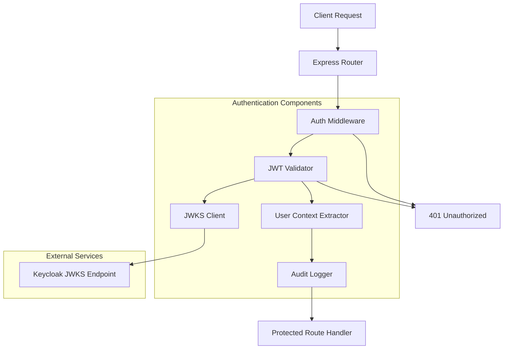

# Design Document

## Overview

This design document outlines the implementation of Keycloak JWT token-based authentication for the Financial Reports CLI and HTTP API. The solution integrates with Keycloak's OpenID Connect endpoints to validate JWT tokens, extract user identity, and provide comprehensive audit logging for compliance requirements.

The authentication system will be implemented as Express.js middleware that validates JWT tokens using Keycloak's JSON Web Key Set (JWKS) endpoint, supports both user and service account authentication, and provides detailed logging for security auditing.

## Architecture

The authentication system follows a middleware-based architecture that integrates seamlessly with the existing Express.js HTTP API:



### Key Architectural Principles

1. **Middleware-First Design**: Authentication is implemented as Express middleware for easy integration
2. **Stateless Validation**: JWT tokens are validated without server-side session storage
3. **Caching Strategy**: JWKS keys are cached to reduce external API calls
4. **Graceful Degradation**: System continues operating with cached keys if Keycloak is temporarily unavailable
5. **Security by Default**: All endpoints are protected unless explicitly marked as public

## Components and Interfaces

### AuthenticationMiddleware

The main middleware component that orchestrates JWT validation:

```typescript
interface AuthenticationMiddleware {
  // Main middleware function
  authenticate(req: Request, res: Response, next: NextFunction): Promise<void>
  
  // Configuration
  configure(config: AuthConfig): void
  
  // Health check for monitoring
  isHealthy(): Promise<boolean>
}

interface AuthConfig {
  keycloakUrl: string
  realm: string
  clientId?: string
  jwksUri?: string
  cacheTimeout: number
  rateLimitConfig: RateLimitConfig
}
```

### JWTValidator

Handles the core JWT validation logic:

```typescript
interface JWTValidator {
  // Validate JWT token signature and claims
  validateToken(token: string): Promise<JWTPayload>
  
  // Get public keys from JWKS endpoint
  getPublicKeys(): Promise<JWK[]>
  
  // Refresh JWKS cache
  refreshKeys(): Promise<void>
}

interface JWTPayload {
  sub: string          // Subject (user ID)
  preferred_username: string
  email?: string
  realm_access: {
    roles: string[]
  }
  resource_access?: {
    [clientId: string]: {
      roles: string[]
    }
  }
  iss: string          // Issuer
  aud: string          // Audience
  exp: number          // Expiration time
  iat: number          // Issued at time
  jti: string          // JWT ID
}
```

### JWKSClient

Manages communication with Keycloak's JWKS endpoint:

```typescript
interface JWKSClient {
  // Fetch JWKS from Keycloak
  fetchJWKS(): Promise<JWKS>
  
  // Get cached JWKS
  getCachedJWKS(): JWKS | null
  
  // Convert JWK to PEM format for verification
  jwkToPem(jwk: JWK): string
}

interface JWKS {
  keys: JWK[]
}

interface JWK {
  kty: string          // Key type
  use: string          // Public key use
  kid: string          // Key ID
  x5t: string          // X.509 thumbprint
  n: string            // Modulus
  e: string            // Exponent
  x5c: string[]        // X.509 certificate chain
}
```

### UserContextExtractor

Extracts and structures user information from validated JWT tokens:

```typescript
interface UserContextExtractor {
  // Extract user context from JWT payload
  extractUserContext(payload: JWTPayload): UserContext
  
  // Check if token represents a service account
  isServiceAccount(payload: JWTPayload): boolean
}

interface UserContext {
  userId: string
  username: string
  email?: string
  roles: string[]
  clientRoles: { [clientId: string]: string[] }
  realm: string
  isServiceAccount: boolean
  tokenId: string
  expiresAt: Date
}
```

### AuthenticationAuditor

Handles comprehensive logging of authentication events:

```typescript
interface AuthenticationAuditor {
  // Log successful authentication
  logAuthSuccess(context: AuthEvent): void
  
  // Log authentication failure
  logAuthFailure(context: AuthEvent): void
  
  // Log token expiration
  logTokenExpiration(context: AuthEvent): void
  
  // Log security alerts
  logSecurityAlert(context: SecurityAlert): void
}

interface AuthEvent {
  correlationId: string
  timestamp: Date
  userId?: string
  username?: string
  sourceIp: string
  userAgent: string
  endpoint: string
  method: string
  success: boolean
  errorCode?: string
  errorMessage?: string
}

interface SecurityAlert {
  type: 'RATE_LIMIT_EXCEEDED' | 'SUSPICIOUS_PATTERN' | 'INVALID_TOKEN_STRUCTURE'
  severity: 'LOW' | 'MEDIUM' | 'HIGH'
  details: Record<string, any>
  sourceIp: string
  timestamp: Date
}
```

## Data Models

### Configuration Model

```typescript
interface KeycloakAuthConfig {
  // Keycloak server configuration
  keycloak: {
    url: string
    realm: string
    clientId?: string
    clientSecret?: string
  }
  
  // JWT validation settings
  jwt: {
    issuer: string
    audience?: string
    algorithms: string[]
    clockTolerance: number
  }
  
  // JWKS caching configuration
  jwks: {
    cacheTimeout: number
    rateLimit: number
    requestsPerMinute: number
  }
  
  // Security settings
  security: {
    rateLimitWindowMs: number
    rateLimitMaxRequests: number
    requireHttps: boolean
    allowedOrigins?: string[]
  }
  
  // Logging configuration
  logging: {
    level: 'debug' | 'info' | 'warn' | 'error'
    auditEnabled: boolean
    includeTokenClaims: boolean
  }
}
```

### Request Context Model

```typescript
// Extended Express Request with authentication context
interface AuthenticatedRequest extends Request {
  user: UserContext
  correlationId: string
  authTimestamp: Date
}
```

## Correctness Properties

*A property is a characteristic or behavior that should hold true across all valid executions of a system-essentially, a formal statement about what the system should do. Properties serve as the bridge between human-readable specifications and machine-verifiable correctness guarantees.*

Let me analyze the acceptance criteria to determine testable properties:

### Converting EARS to Properties

Based on the prework analysis, here are the key correctness properties:

**Property 1: Token validation consistency**
*For any* request without a JWT token, the Authentication_Service should return HTTP 401 Unauthorized
**Validates: Requirements 1.1**

**Property 2: Invalid token rejection**
*For any* request with an invalid JWT token, the Authentication_Service should return HTTP 401 Unauthorized with appropriate error details
**Validates: Requirements 1.2**

**Property 3: Expired token handling**
*For any* request with an expired JWT token, the Authentication_Service should return HTTP 401 Unauthorized with expiration information
**Validates: Requirements 1.3**

**Property 4: Valid token acceptance**
*For any* request with a valid JWT token, the Authentication_Service should allow the request to proceed and extract user context
**Validates: Requirements 1.4, 2.5**

**Property 5: Comprehensive claim extraction**
*For any* valid JWT token, the Authentication_Service should extract all required claims (user ID, username, roles, realm) and make them available in user context
**Validates: Requirements 2.1, 2.2, 2.3, 2.4**

**Property 6: JWKS signature validation**
*For any* JWT token, signature validation should use keys retrieved from Keycloak's JWKS endpoint, and tokens signed with incorrect keys should be rejected
**Validates: Requirements 1.5**

**Property 7: JWKS caching resilience**
*For any* authentication request when JWKS endpoint is unavailable, the Authentication_Service should continue validation using cached keys
**Validates: Requirements 3.2**

**Property 8: Multi-realm support**
*For any* valid JWT token from any configured realm, the Authentication_Service should correctly validate and extract realm-specific information
**Validates: Requirements 3.4**

**Property 9: Service account handling**
*For any* service account JWT token, the Authentication_Service should correctly identify it as a service account and extract appropriate identity information
**Validates: Requirements 4.1, 4.2**

**Property 10: Comprehensive audit logging**
*For any* authentication event (success, failure, expiration), the Audit_Logger should create structured JSON logs with correlation IDs and appropriate details
**Validates: Requirements 5.1, 5.2, 5.3, 5.4, 5.5**

**Property 11: Configuration flexibility**
*For any* valid configuration parameters (URLs, timeouts, validation settings), the Authentication_Service should apply them correctly
**Validates: Requirements 6.1, 6.2, 6.3**

**Property 12: Secure error handling**
*For any* authentication failure, the Authentication_Service should return generic error messages to clients while logging detailed information internally
**Validates: Requirements 7.1, 7.5**

**Property 13: Rate limiting protection**
*For any* source IP making excessive authentication requests, the Authentication_Service should apply rate limiting and log security alerts
**Validates: Requirements 7.2, 7.3**

**Property 14: Token structure validation**
*For any* malformed JWT token, the Authentication_Service should reject it before attempting signature verification
**Validates: Requirements 7.4**

## Error Handling

The authentication system implements comprehensive error handling with security-first principles:

### Error Categories

1. **Authentication Errors (401)**
   - Missing JWT token
   - Invalid token signature
   - Expired token
   - Malformed token structure
   - Invalid issuer or audience

2. **Authorization Errors (403)**
   - Insufficient permissions for endpoint
   - Invalid realm for resource

3. **System Errors (500)**
   - JWKS endpoint unavailable (with fallback to cache)
   - Configuration errors
   - Internal validation failures

### Error Response Format

```typescript
interface AuthErrorResponse {
  error: string
  error_description?: string
  correlation_id: string
  timestamp: string
}

// Example responses
{
  "error": "invalid_token",
  "error_description": "The access token is expired",
  "correlation_id": "req_123456789",
  "timestamp": "2025-01-13T10:30:00.000Z"
}
```

### Security Considerations

- Error messages to clients are generic to prevent information leakage
- Detailed error information is logged internally for debugging
- Rate limiting prevents brute force attacks
- Suspicious patterns trigger security alerts

## Testing Strategy

The authentication system will be validated through a comprehensive dual testing approach:

### Unit Testing

Unit tests will focus on specific components and edge cases:

- **JWT Validation Logic**: Test token parsing, signature verification, and claim extraction
- **JWKS Client**: Test key fetching, caching, and error handling
- **Configuration Loading**: Test environment variable parsing and validation
- **Error Handling**: Test specific error scenarios and response formatting
- **Audit Logging**: Test log formatting and correlation ID generation

### Property-Based Testing

Property-based tests will verify universal properties across all inputs using **fast-check** library:

- **Minimum 100 iterations** per property test for comprehensive coverage
- **Token Generation**: Generate random valid/invalid JWT tokens for validation testing
- **Configuration Testing**: Generate random configuration combinations
- **Rate Limiting**: Generate request patterns to test rate limiting behavior
- **Multi-realm Testing**: Generate tokens from different realms

Each property test will be tagged with:
```typescript
// Feature: keycloak-authentication, Property 1: Token validation consistency
```

### Integration Testing

Integration tests will validate end-to-end authentication flows:

- **Keycloak Integration**: Test against real Keycloak instance
- **Express Middleware**: Test middleware integration with routes
- **JWKS Endpoint**: Test key rotation and caching scenarios
- **Multi-tenant Scenarios**: Test multiple realm configurations

### Security Testing

Specialized security tests will validate attack resistance:

- **Token Tampering**: Test response to modified tokens
- **Replay Attacks**: Test token reuse scenarios
- **Rate Limiting**: Test brute force protection
- **Information Leakage**: Verify error messages don't reveal sensitive data

The testing strategy ensures both functional correctness and security robustness of the authentication system.